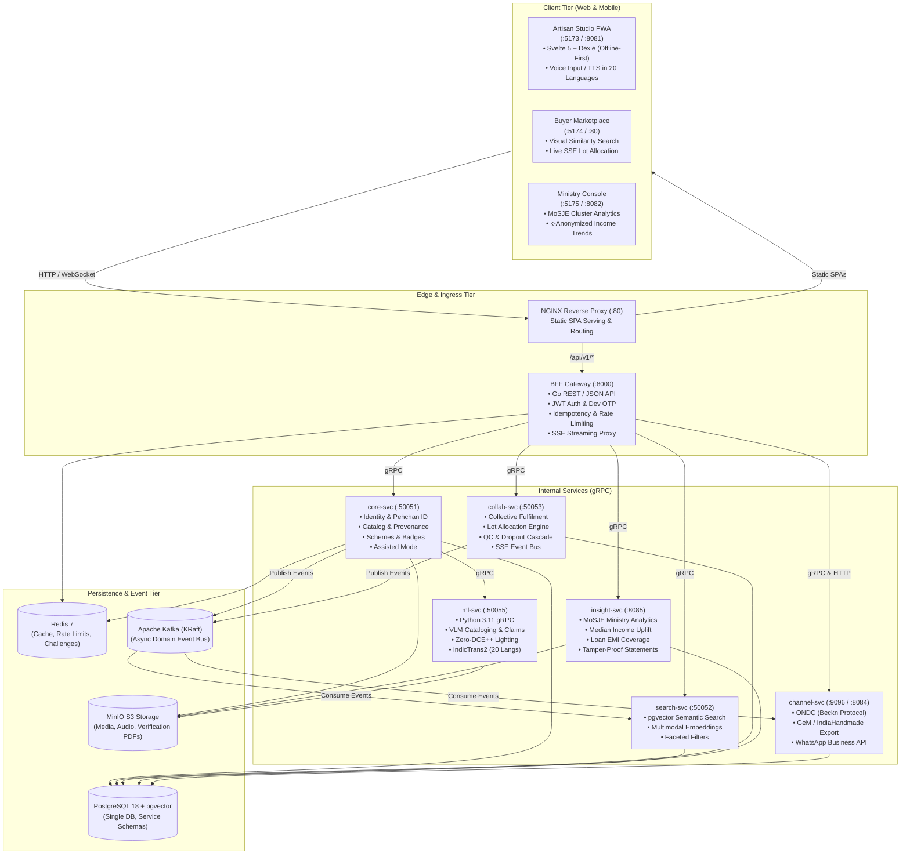

# Kalakriti (कलाकृति)

[](https://go.dev/)
[](https://www.python.org/)
[-FF3E00?style=flat&logo=svelte)](https://svelte.dev/)
[](https://github.com/pgvector/pgvector)
[](https://kafka.apache.org/)
[](https://www.docker.com/)
[](LICENSE)

> **AI Cataloging, Cryptographic Provenance, and Collective Fulfilment Platform for Indian Artisans and Handloom Clusters.**  
> *Developed for the Smart India Hackathon (SIH) under the Ministry of Social Justice and Empowerment (MoSJE).*

---

## 🌐 Live Deployments

| Application | Subdomain | Status |
| :--- | :--- | :--- |
| **Buyer (Main Web)** | [kalakriti.me](https://kalakriti.me) | Production |
| **Artisan Portal** | [artisan.kalakriti.me](https://artisan.kalakriti.me) | Production |
| **Admin Dashboard** | [admin.kalakriti.me](https://admin.kalakriti.me) | Production |

## Table of Contents

1. [Executive Summary](#executive-summary)
2. [High-Level Architecture](#high-level-architecture)
3. [The Microservices Suite](#the-microservices-suite)
   - [BFF (Backend-For-Frontend)](#1-bff-servicesbff)
   - [Core Service (`core-svc`)](#2-core-service-servicescore-svc)
   - [Search Service (`search-svc`)](#3-search-service-servicessearch-svc)
   - [Collab Service (`collab-svc`)](#4-collab-service-servicescollab-svc)
   - [Channel Service (`channel-svc`)](#5-channel-service-serviceschannel-svc)
   - [Insight Service (`insight-svc`)](#6-insight-service-servicesinsight-svc)
   - [ML Service (`ml-svc`)](#7-ml-service-servicesml-svc)
4. [The Frontend Applications (`web/`)](#the-frontend-applications-web)
   - [Artisan Studio PWA](#artisan-studio-pwa-webappsartisan)
   - [Buyer Marketplace & B2B Portal](#buyer-marketplace--b2b-portal-webappsbuyer)
   - [Ministry & Admin Console](#ministry--admin-console-webappsadmin)
   - [Design System & Shared Packages](#design-system--shared-packages)
5. [Key Technical Differentiators](#key-technical-differentiators)
   - [Cryptographic Provenance Engine](#1-cryptographic-provenance-engine)
   - [Distributed Lot Allocation Algorithm](#2-distributed-lot-allocation-algorithm)
   - [Offline-First Sync Engine](#3-offline-first-sync-engine)
   - [Privacy-Preserving Income Tracking](#4-privacy-preserving-income-tracking)
   - [Vernacular Voice & Multimodal AI](#5-vernacular-voice--multimodal-ai)
6. [Data Store, Messaging & Infrastructure](#data-store-messaging--infrastructure)
7. [Getting Started & Local Setup](#getting-started--local-setup)
   - [Prerequisites](#prerequisites)
   - [One-Command Quickstart](#one-command-quickstart)
   - [Running Frontend Dev Servers](#running-frontend-dev-servers)
   - [Environment Variables](#environment-variables)
8. [Testing, Chaos & Observability](#testing-chaos--observability)
9. [Repository Layout](#repository-layout)

---

## Executive Summary

India is home to over 7 million traditional artisans and handloom weavers across 700+ distinct clusters, representing centuries of cultural heritage. Despite immense global demand for authentic Indian handicrafts, rural artisans face severe structural challenges:

1. **Digital & Linguistic Divide:** Most artisans rely on low-end smartphones on 2G/3G networks and speak vernacular dialects, rendering conventional text-heavy eCommerce portals inaccessible.
2. **Counterfeits & Value Erosion:** Cheap machine-made replicas exploit genuine craft names, depriving traditional artisans of fair value and destroying buyer confidence.
3. **Capacity Constraints for Bulk Orders:** Individual artisans cannot accept 5,000-piece orders from corporate or export buyers, locking them out of lucrative enterprise procurement.
4. **Predatory Intermediaries:** Artisans receive a fraction of retail prices, while lacking verifiable records to secure credit from government finance corporations (NSFDC, NBCFDC, NSKFDC).

**Kalakriti** is an end-to-end open architecture that solves these challenges through:
- **Zero-barrier, voice-first AI cataloging** that generates rich product stories, claims, and specifications directly from low-light smartphone photographs.
- **Tamper-proof cryptographic provenance** combining SHA-256 hash chains, Ed25519 digital signatures, and public QR verification tags.
- **Algorithmic collective fulfilment** that splits massive institutional orders across dozens of village artisans, dynamically managing production lots, quality checkpoints, and automatic reallocation upon dropouts.
- **Privacy-preserving income uplift analytics** for the Ministry of Social Justice and Empowerment (MoSJE), directly linking platform income with government welfare schemes and loan programs.

---

## High-Level Architecture

The platform follows a clean separation of concerns: single REST/JSON edge gateway (BFF), internal high-performance gRPC microservices, an asynchronous Kafka event backbone, and a unified PostgreSQL database with `pgvector`.



---

## The Microservices Suite

The backend comprises seven focused microservices. All inter-service communication runs over high-throughput, strongly-typed **gRPC** with contracts defined in [`proto/`](file:///c:/SIh/kalakriti/proto).

### 1. BFF (`services/bff`)
*The unified HTTP/REST Edge Gateway*
- **Technology:** Go 1.23+, `net/http`, Redis, OpenTelemetry.
- **Port:** HTTP `:8000`.
- **Core Responsibilities:**
  - Exposes ~90 REST/JSON endpoints consumed by the three SvelteKit frontends.
  - Automatically generates and self-serves its OpenAPI 3.0 specification at `GET /api/v1/openapi.json`.
  - Enforces strict **Idempotency** via `X-Idempotency-Key` headers backed by PostgreSQL and Redis to guarantee safe retries across unstable rural mobile networks.
  - Manages **CSRF Protection** and CORS origin validation across development, preview, and production domains.
  - Real-time **Server-Sent Events (SSE)** proxy for live order allocation tracking (`GET /api/v1/orders/{id}/events`).
  - Webhook ingress and HMAC signature verification (`pkg/webhook`).

### 2. Core Service (`services/core-svc`)
*The Primary Domain Backbone*
- **Technology:** Go 1.23+, `pgxpool`, `sqlc`, Ed25519 cryptography, MinIO SDK.
- **Ports:** gRPC `:50051`, HTTP `:8081` (health/ready).
- **Core Responsibilities:**
  - **Identity & Pehchan:** Artisan registration, Pehchan ID validation, caste/social category tracking, Self-Help Group (SHG) and cooperative mapping.
  - **Catalog & Wizard:** Multi-step listing draft state machine (`DRAFT -> PENDING_APPROVAL -> APPROVED -> PUBLISHED`).
  - **Cryptographic Provenance:** Ed25519 asymmetric signature generation, SHA-256 content hashing, immutable hash chaining per artisan, and short-code allocation.
  - **Artisan Badges:** Verification and display of GI (Geographical Indication) tags, Handloom Mark, Craft Mark, Silk Mark, and Organic Cotton certifications.
  - **Assisted Mode:** Scoped delegation enabling Common Service Centre (CSC) field agents to act on behalf of non-smartphone-literate artisans, verified by OTP or recorded voice consent.
  - **Digital Literacy:** 8-lesson digital skills curriculum tracking and verifiable certificate issuance.
  - **B2B Buyers:** Corporate buyer registration, GSTIN verification, and boutique matching.

### 3. Search Service (`services/search-svc`)
*Vector Similarity and Multimodal Discovery*
- **Technology:** Go 1.23+, PostgreSQL `pgvector`, Kafka consumer.
- **Ports:** gRPC `:50052`, HTTP `:8082` (health).
- **Core Responsibilities:**
  - Powers semantic search across 768-dimensional multimodal vector embeddings generated from craft images and descriptions.
  - Executes hybrid vector + lexical search (tsvector full-text search combined with cosine distance).
  - Multi-dimensional faceted filtering: craft taxonomy, GI status, geographic state/cluster, price range (in paise), and lead time.
  - Real-time event synchronization: listens to Kafka `catalog.listing.published` and `catalog.listing.updated` topics to update search indices with sub-second latency.

### 4. Collab Service (`collab-svc`)
*Collective Fulfilment & Pooled Orders*
- **Technology:** Go 1.23+, `sqlc`, Kafka producer/consumer, SSE broadcaster.
- **Ports:** gRPC `:50053`, HTTP `:8083` (health).
- **Core Responsibilities:**
  - **Lot Decomposition Algorithm:** Breaks massive enterprise orders (e.g., 10,000 hand-carved soapstone coasters) into achievable artisan lots (e.g., 50–200 units per artisan) based on capacity, rating, past fulfilment rate, and cluster proximity.
  - **Production State Machine:** Manages lot transitions (`OFFERED -> ACCEPTED -> IN_PROGRESS -> QC_INSPECTION -> DISPATCHED -> DELIVERED -> SETTLED`).
  - **Dynamic Dropout Cascade:** When an artisan declines or fails to meet milestones, the system automatically reallocates the remaining quota to nearby cluster peers without disrupting the parent order.
  - **Real-Time SSE Event Broadcasting:** Streams live lot lifecycle updates directly to the buyer's order dashboard.

### 5. Channel Service (`channel-svc`)
*Outbound Syndication & Multi-Channel Export*
- **Technology:** Go 1.23+, HTTP client, Kafka consumer.
- **Ports:** gRPC `:9096`, HTTP `:8084` (syndication feed).
- **Core Responsibilities:**
  - **ONDC Integration:** Full compatibility with the Open Network for Digital Commerce (Beckn protocol) for decentralized discovery and transaction handling.
  - **Government e-Marketplace (GeM) & IndiaHandmade.in:** Automated XML/CSV/JSON export bridges mapping artisan listings directly to public procurement standards.
  - **WhatsApp Business API:** Sends automated, translated order notifications, lot offers, and audio voice prompts directly to artisans over WhatsApp.

### 6. Insight Service (`insight-svc`)
*Ministry Analytics & Verified Financial Statements*
- **Technology:** Go 1.23+, `maroto` PDF engine, `sqlc`.
- **Port:** gRPC `:8085` (gRPC only).
- **Core Responsibilities:**
  - **MoSJE Dashboard:** Computes cluster health, active artisan density, and production volume for Ministry of Social Justice and Empowerment reviewers.
  - **Median Income Uplift:** Compares artisan baseline earnings against trailing 90-day platform and self-reported offline sales, clearly annotating data sufficiency.
  - **Differential Privacy & k-Anonymity:** Automatically suppresses groupings smaller than 5 artisans (`<5`) to prevent individual identification from aggregated reports.
  - **Loan Linkage:** Securely links loans from central finance corporations (NSFDC, NBCFDC, NSKFDC, NDFDC, PM-DAKSH) and computes monthly EMI coverage ratios.
  - **Cryptographic Income Statements:** Generates signed, printable PDF income statements featuring verifiable shortcode QR codes (`/v/{code}`).

### 7. ML Service (`ml-svc`)
*AI Vision, Translation & Multimodal Cataloging*
- **Technology:** Python 3.11, PyTorch, Hugging Face Transformers, llama.cpp, gRPC.
- **Ports:** gRPC `:50055`, Prometheus `:9095` (mapped to `:9097` on host).
- **Core Capabilities:**
  - **Vision-Language Models (VLM):** LLaVA / Qwen2-VL checkpoints running either in-process via PyTorch or out-of-process via an optimized `llama.cpp` server. Automatically extracts technical attributes, materials, and cultural heritage narratives from craft photos.
  - **Low-Light Image Enhancement:** Deep curve estimation using Zero-DCE++ (`Epoch99.pth`) to restore poorly lit photographs taken in rural workshop settings.
  - **Background Normalization:** Salient object detection via U2-Net for clean catalog presentation.
  - **Indic Language Translation:** IndicTrans2 model inference supporting 20 official Indian languages.
  - **Instant Mock Mode:** Enabled by default (`ML_SVC_MOCK_MODE=true`), allowing complete local frontend and backend development with <2-second startup time and zero GPU requirements.

---

## The Frontend Applications (`web/`)

The frontend layer is organized as a high-performance **pnpm monorepo** containing three distinct SvelteKit applications and shared component packages. All applications are built using **SvelteKit 2** and **Svelte 5** (100% Runes: `$state`, `$derived`, `$props`), strictly adhering to WCAG AAA accessibility and vanilla CSS tokens (no Tailwind or bloated CSS frameworks).

```
web/
├── apps/
│   ├── artisan/       # Low-bandwidth PWA for artisans (:5173 / :8081)
│   ├── buyer/         # B2C & B2B marketplace (:5174 / :80)
│   └── admin/         # Ministry of Social Justice & Empowerment console (:5175 / :8082)
└── packages/
    ├── tokens/        # Craft color palettes (terracotta, indigo, haldi), fonts, scale
    ├── ui/            # Accessible Svelte 5 component library (WCAG AAA)
    ├── api/           # Type-safe API client, SSE stream receiver, auth handlers
    ├── offline/       # Dexie/IndexedDB sync engine, mutation outbox queue
    ├── voice/         # Vernacular speech synthesis and recognition
    ├── icons/         # Custom craft SVG icon suite
    ├── illustrations/ # Handcrafted process SVGs (weaving, pottery, blockprint)
    ├── ornament/      # Indian motifs: jaali, kolam corners, woven rules
    ├── patterns/      # Heritage textures (ajrakh, bagru, dabu, paper-grain)
    ├── motion/        # Svelte transitions and micro-animations
    ├── observability/ # Client error boundary and performance telemetry
    └── print/         # Printable packaging tags and QR labels
```

### Artisan Studio PWA (`web/apps/artisan`)
- **Target Device:** Low-cost Android smartphones on intermittent 2G/3G connections.
- **Budget:** Strict <150 KB initial asset budget.
- **Capabilities:**
  - Full **offline-first** operation: every action (creating drafts, uploading media, accepting lots) is queued in an IndexedDB outbox via Dexie and automatically synchronized upon reconnecting.
  - **Voice Navigation & Audio Feedback:** Artisans can dictate descriptions and listen to incoming orders in their chosen local language.
  - **Listing Creation Wizard:** Capture photos, review AI-enhanced attributes, select pricing models, and publish in under 3 minutes.
  - **Pehchan ID & Scheme Hub:** View eligible government welfare schemes, check badge statuses, and complete digital literacy training modules.

### Buyer Marketplace & B2B Portal (`web/apps/buyer`)
- **Target Audience:** Retail consumers, interior designers, and corporate procurement teams.
- **Capabilities:**
  - **Multimodal Visual Search:** Drag and drop an image or use natural language to find matching authentic crafts across India.
  - **Provenance Transparency:** Inspect verified artisan credentials, GI tag certificates, and production process stages.
  - **Bulk Order Allocator:** Enterprise buyers can configure orders for thousands of units, view real-time cluster capacity, and track order fulfillment across dozens of artisans live via SSE.

### Ministry & Admin Console (`web/apps/admin`)
- **Target Audience:** Ministry of Social Justice and Empowerment (MoSJE) officials and Cluster Development Officers (CDOs).
- **Capabilities:**
  - Real-time heatmaps of artisan clusters across India.
  - Verification queues for Pehchan IDs, SHG affiliations, and craft certifications.
  - Anonymized median income reports and loan EMI repayment coverage indicators.
  - Field agent audit logs and consent verification records.

---

## Key Technical Differentiators

### 1. Cryptographic Provenance Engine
To eliminate counterfeit machine-made goods, Kalakriti creates an immutable, verifiable chain of custody for every handcrafted piece:
- **Canonical Serialization:** Listing metadata, artisan identity, materials, and batch information are deterministically normalized using canonical JSON encoding (`pkg/canonical`).
- **Ed25519 Asymmetric Signing:** The record is signed with the platform's private key and linked to the artisan's previous entry in a SHA-256 hash chain (`migrations/022_provenance.sql`).
- **Base32 Short Codes:** Each sealed record receives a compact, collision-checked 10-character code.
- **Zero-JS Public Verification:** Scanning the physical QR code on the packaging routes to `/v/{code}`, a server-rendered verification page that displays the artisan's portrait, cluster, materials, and cryptographic seal without requiring JavaScript or an app install.

### 2. Distributed Lot Allocation Algorithm
Institutional buyers often require quantities far beyond the capacity of any single rural artisan. The collective fulfilment engine solves this through algorithmic lot decomposition:
1. When a buyer submits a bulk order for $N$ units, `collab-svc` queries `core-svc` for active artisans in the designated craft cluster.
2. The engine filters artisans by skill tier, historical on-time delivery rate, and current open capacity.
3. Lots sized between $L_{min}$ and $L_{max}$ are created and offered to artisans via SMS, WhatsApp, and PWA push notifications.
4. **Dropout Handling:** If an artisan fails to accept within the offer window or flags a production delay, the lot is automatically split or cascaded to eligible backup artisans in the same cluster, preserving the master delivery schedule.

### 3. Offline-First Sync Engine
Because Indian artisan clusters are frequently located in remote rural areas with spotty connectivity, the artisan application cannot assume an internet connection:
- Implemented with **Dexie** (IndexedDB) in `@kalakriti/offline`.
- Mutating operations (`draft.upsert`, `media.upload`, `lot.accept`) are immediately committed to a local outbox with optimistic UI updates.
- A persistent background drainer monitors `navigator.onLine` and network round-trip latency, replaying requests in strict FIFO order with exponential backoff and jitter.
- Every mutating request includes an `X-Idempotency-Key` header, guaranteeing that network reconnections and duplicate retries never cause duplicate database writes.

### 4. Privacy-Preserving Income Tracking
To measure genuine economic empowerment without compromising artisan privacy:
- **Loan De-identification:** Loan reference numbers from NSFDC/NBCFDC are never stored in plaintext. The database retains only the last 4 characters and a salted HMAC (`FINANCE_REF_SALT`) to detect duplicates.
- **$k$-Anonymity Metric Protection:** Aggregated income figures across districts, crafts, or social categories require a minimum cohort of 5 artisans. Any smaller bucket is automatically reported as `"<5"`, ensuring individual artisans cannot be reverse-engineered from public ministry dashboards.

### 5. Vernacular Voice & Multimodal AI
Artisans can navigate, list products, and communicate without requiring English or typed input:
- Speech recognition and Web Speech synthesis in `@kalakriti/voice`.
- Deep vision pipeline: Zero-DCE++ curves boost low-light craft photos; U2-Net removes cluttered background workshop surfaces.
- Automated translation pipeline: IndicTrans2 bridges artisan descriptions across 20 official scheduled Indian languages.

---

## Data Store, Messaging & Infrastructure

| Component | Technology | Role in Kalakriti |
|---|---|---|
| **Primary Database** | PostgreSQL 18 + `pgvector` | Unified persistence across microservices with schema isolation; stores embeddings, relational catalogs, orders, and hash chains. |
| **Database Migrations** | Goose (`migrations/`) | 35+ declarative SQL migrations covering table schemas, foreign keys, and vector indices. |
| **In-Memory Cache** | Redis 7 Alpine | Token revocation list, challenge-response OTP storage, distributed rate limiting, and session caching. |
| **Message Broker** | Apache Kafka 7.5 (KRaft) | Event-driven architecture handling asynchronous domain events (`order.created`, `listing.published`, `qc.failed`). |
| **Object Storage** | MinIO (S3 API) | Presigned upload/download storage for high-resolution artisan imagery, process videos, voice consent audio, and PDF statements. |
| **Reverse Proxy** | NGINX Alpine | Serves compiled static web apps on port 80/8081/8082 and reverse-proxies `/api/v1/*` to the Go BFF. |
| **Distributed Tracing**| OpenTelemetry + Jaeger | Full request trace propagation across HTTP, gRPC, and Kafka boundaries. |
| **Metrics Collection** | Prometheus | Real-time metrics collection across all Go services, Python ML service, and system infrastructure. |

---

## Getting Started & Local Setup

### Prerequisites

| Tool | Recommended Version | Purpose |
|---|---|---|
| **Docker & Docker Compose** | 24+ (Compose v2) | Running infrastructure, databases, and microservices |
| **Go** | 1.23+ | Backend Go workspace development (`go.work`) |
| **Node.js** | 20+ | Frontend applications (`web/`) |
| **pnpm** | 10.26+ | Monorepo package manager |
| **Python** | 3.11 | ML service development (optional if using Docker) |
| **GNU Make** | 4+ | Centralized build and lifecycle commands |

> [!TIP]
> Ensure `$(go env GOPATH)/bin` is included in your shell `$PATH`. The code generation steps require `protoc-gen-go` and `protoc-gen-go-grpc`.

---

### One-Command Quickstart

The fastest way to spin up the complete Kalakriti stack—including databases, messaging, Go microservices, Python ML service (mock mode), NGINX, and seeded demo data—is via `make demo-up`:

```bash
# 1. Clone the repository
git clone https://github.com/ZoroNewbie00/kalakriti.git
cd kalakriti

# 2. Copy the environment template
cp .env.example .env

# 3. Boot the full stack, run migrations, and seed initial demo data
make demo-up
```

Once running, the services are available at:

| Service / App | URL | Description |
|---|---|---|
| **Buyer Marketplace** | [http://localhost](http://localhost) | Public marketplace and collective ordering |
| **Artisan Studio PWA** | [http://localhost:8081](http://localhost:8081) | Artisan mobile interface (or [http://localhost:5173](http://localhost:5173) in dev) |
| **Ministry Admin Console** | [http://localhost:8082](http://localhost:8082) | MoSJE monitoring console (or [http://localhost:5175](http://localhost:5175) in dev) |
| **REST API / BFF** | [http://localhost:8000](http://localhost:8000) | REST Gateway (API docs at `/api/v1/openapi.json`) |
| **Jaeger Tracing UI** | [http://localhost:16686](http://localhost:16686) | Distributed request traces |
| **Prometheus Metrics** | [http://localhost:9090](http://localhost:9090) | System and service metrics |
| **MinIO Console** | [http://localhost:9001](http://localhost:9001) | S3 Object browser (`minioadmin` / `minioadmin`) |

To stop the environment:
```bash
make down
```

---

### Running Frontend Dev Servers

For rapid frontend UI development with Vite hot-module replacement (HMR):

```bash
cd web
pnpm install

# Start all three apps simultaneously:
pnpm dev

# Or start individually:
pnpm dev:artisan   # http://localhost:5173
pnpm dev:buyer     # http://localhost:5174
pnpm dev:admin     # http://localhost:5175
```

Each app connects to the running BFF API on port 8000. If you wish to run the frontend entirely detached from the backend, set `VITE_USE_MOCKS=1` in your frontend environment.

---

### Environment Variables

All services load configuration from environment variables defined in [`.env.example`](file:///c:/SIh/kalakriti/.env.example). Key configuration groups include:

- `POSTGRES_DSN`: PostgreSQL connection string (default host port `15432`).
- `BASE_URL`: Public base URL of the BFF (`http://localhost:8000`).
- `JWT_SECRET`: Secret used to sign and verify HS256 auth tokens (must be $\ge 32$ bytes).
- `AUTH_DEV_OTP_ENABLED`: Set to `true` to allow bypassing SMS delivery using OTP `000000`.
- `ML_SVC_MOCK_MODE`: Set to `true` for instantaneous local startup without ML model downloads.
- `CORS_ALLOWED_ORIGINS`: Comma-separated list of browser origins permitted to issue mutating requests to the BFF.

---

## Testing, Chaos & Observability

### Running Test Suites

```bash
# Run all Go unit tests across all microservices
make test

# Run Python ML test suite
make test-ml

# Run frontend tests across all SvelteKit apps & packages
cd web && pnpm test

# Run Svelte type-checking & linting
cd web && pnpm check && pnpm lint
```

### Chaos Engineering Suite

The [`scripts/chaos/`](file:///c:/SIh/kalakriti/scripts/chaos) directory contains automated fault-injection scripts to validate system resilience under harsh operating conditions:

```bash
bash scripts/chaos/run-suite.sh
```
- `service-crash.sh`: Simulates random worker failures and verifies Kafka consumer rebalancing.
- `kafka-partition.sh`: Validates outbox buffering during temporary broker disconnects.
- `db-latency.sh`: Tests circuit breaker trips and client timeouts under database load.
- `redis-flush.sh`: Verifies authentication recovery when session caches are invalidated.

### Load Testing

A comprehensive k6 load-testing suite is available in [`scripts/load-test/`](file:///c:/SIh/kalakriti/scripts/load-test), simulating concurrent artisan uploads, bulk order allocations, and vector search queries.

---

## Repository Layout

```
kalakriti/
├── .github/workflows/     # GitHub Actions CI workflow (Go, SvelteKit, Postgres)
├── cmd/                   # CLI tools & demo seed binaries (seed-demo, etc.)
├── data/                  # Static assets and reference data
├── deploy/                # Deployment configurations (k8s manifests, NGINX configs)
├── docs/                  # Detailed architectural specifications and operational guides
│   ├── API.md             # REST API endpoint catalog
│   ├── BACKEND_FLOW.md    # End-to-end request flow traces
│   ├── BACKUP_RESTORE.md  # Database backup and disaster recovery procedures
│   ├── CHAOS_TESTING.md   # Fault-injection runbook
│   ├── CIRCUIT_BREAKERS.md# Fault tolerance and circuit breaker configurations
│   ├── COMPLIANCE_AUDIT.md# Security, data privacy, and government standard audits
│   ├── DEPLOYMENT_GUIDE.md# Production Kubernetes and container deployment
│   ├── FRAUD_DETECTION.md # Anomaly detection and integrity enforcement
│   ├── MICROSERVICES.md   # Service architecture and dependency map
│   ├── ML_SETUP.md        # Real ML model checkpoints, GPU acceleration, and VLM setup
│   └── PORTS_AND_APIS.md  # Ground-truth port mappings and protocol specifications
├── migrations/            # Goose SQL migrations (001 to 035+)
├── pkg/                   # Reusable Go packages (auth, crypto, httpx, postgres, kafka, pb)
├── proto/                 # Protocol Buffer API definitions (source of truth)
├── scripts/               # Operational, backup, chaos, and load-testing scripts
├── services/              # Microservice implementations
│   ├── bff/               # Go REST API Gateway
│   ├── core-svc/          # Identity, Catalog, Provenance, Badges, Assisted Mode
│   ├── search-svc/        # pgvector Semantic & Multimodal Search
│   ├── collab-svc/        # Collective Fulfilment & Lot Allocation Engine
│   ├── channel-svc/       # ONDC, GeM, IndiaHandmade, WhatsApp Syndication
│   ├── insight-svc/       # MoSJE Ministry Analytics & Verifiable Statements
│   └── ml-svc/            # Python 3.11 Vision, Translation & Embedding Server
├── web/                   # SvelteKit 2 / Svelte 5 frontend monorepo
├── .dockerignore          # Docker build exclusions
├── .env.example           # Comprehensive environment variable template
├── .gitignore             # Git ignore patterns
├── docker-compose.yml     # Complete local container orchestration
├── docker-compose.gpu.yml # Optional GPU acceleration overlay for ml-svc
├── Makefile               # Build, test, codegen, and lifecycle commands
└── README.md              # Project documentation
```

---

## Contributing & Development Guidelines

1. **Protocol Buffers First:** Any change to service interfaces must originate in [`proto/`](file:///c:/SIh/kalakriti/proto). Run `make proto` to regenerate Go and Python stubs.
2. **Schema Migrations:** Database changes must be added as forward-compatible migrations in [`migrations/`](file:///c:/SIh/kalakriti/migrations). Run `make sqlc` to regenerate type-safe Go queries.
3. **Svelte 5 Standards:** All frontend code must use Svelte 5 runes (`$state`, `$derived`, `$props`). Class components and Svelte 4 reactivity syntax are prohibited.
4. **Token-Driven Design:** Components must consume semantic CSS custom properties from `@kalakriti/tokens` rather than hardcoding colors or styles.

---

## License

This project is licensed under the Apache License 2.0. See the [LICENSE](LICENSE) file for details.
